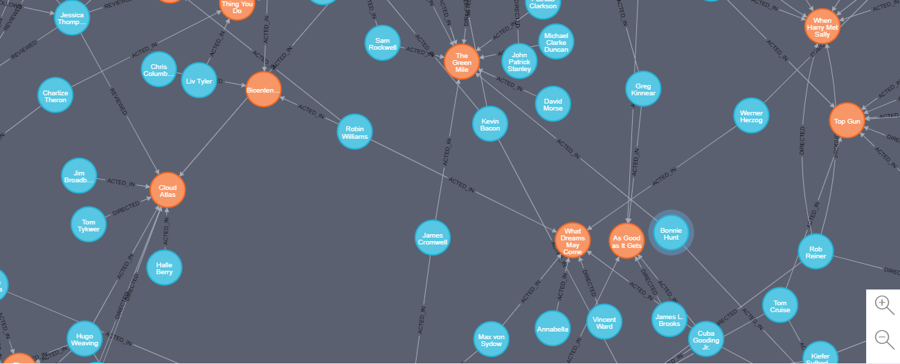
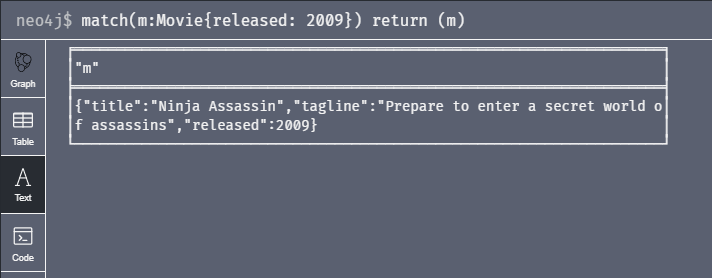
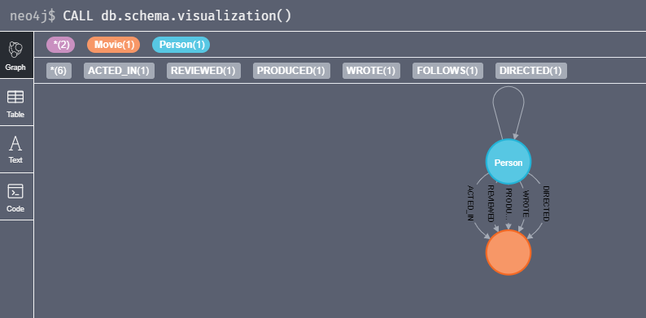
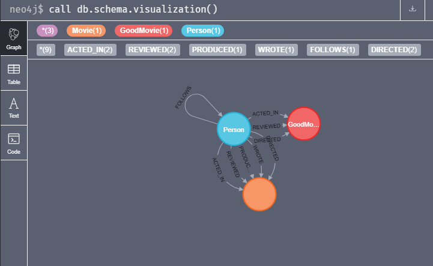

# Atividade da Disciplina de Bancos de dados não relacionais

## Neo4j

### Exercício 1

**Exercise 1.1: Retrieve all nodes from the database.**

`match(n) return (n)`

**Exercise 1.2: Examine the data model for the graph.**

*Conforme visualizado na ferramenta:*

	
**Exercise 1.3: Retrieve all Person nodes.**

`match(p:Person) return (p)`

**Exercise 1.4: Retrieve all Movie nodes.**

`match(m:Movie) return (m)`

### Exercício 2

**Exercise 2.1: Retrieve all movies that were released in a specific year.**

`match(m:Movie{released: 2009}) return (m)`

**Exercise 2.2: View the retrieved results as a table.**

*Conforme visualizado na ferramenta:*

**Exercise 2.3: Query the database for all property keys.**

`match(a) UNWIND keys(a) AS key RETURN collect(distinct key)`

**Exercise 2.4: Retrieve all Movies released in a specific year, returning their titles.**

`match(m{released:1999}) return (m.title)`

**Exercise 2.5: Display title, released, and tagline values for every Movie node in the graph.**

`match(m:Movie) return m.title, m.released, m.tagline`

**Exercise 2.6: Display more user-friendly headers in the table.**

`match(m:Movie) return m.title as Título, m.released as Lançamento, m.tagline as Slogan`

### Exercício 3

**Exercise 3.1: Display the schema of the database.**

`call db.schema.visualization()`

*Conforme visualizado na ferramenta:*

**Exercise 3.2: Retrieve all people who wrote the movie Speed Racer.**

`match (p:Person)-[:WROTE]->(m:Movie{title:'Speed Racer'}) return p`

**Exercise 3.3: Retrieve all movies that are connected to the person,Tom Hanks.**

`match (m:Movie)<--(:Person{name:'Tom Hanks'}) return m`

**Exercise 3.4: Retrieve information about the relationships Tom Hanks had with the set of movies retrieved earlier.**

`match (m:Movie)<-[r]-(:Person{name:'Tom Hanks'}) return distinct type(r)`

**Exercise 3.5: Retrieve information about the roles that Tom Hanks acted in.**

`match (m:Movie)<-[:ACTED_IN]-(:Person{name:'Tom Hanks'}) return m.title, m.role`

### Exercício 4

**Exercise 4.1: Retrieve all movies that Tom Cruise acted in.**

`match (p:Person)-[:ACTED_IN]->(m:Movie) where p.name = 'Tom Cruise' return m`

**Exercise 4.2: Retrieve all people that were born in the 70’s.**

`match (p:Person) where  p.born >= 1970 and p.born < 1980 return p`

**Exercise 4.3: Retrieve the actors who acted in the movie The Matrix who were born after 1960.**

`match(p:Person)-[:ACTED_IN]->(m:Movie) where p.born > 1960 and m.title = 'The Matrix' return p`

**Exercise 4.4: Retrieve all movies by testing the node label and a property.**

`match(m) where m:Movie AND m.released > 1999 AND m.released<=2005 return m.title as TITULO, m.released as LANÇAMENTO ORDER BY m.released DESC`

**Exercise 4.5: Retrieve all people that wrote movies by testing the relationship between two nodes.**

`match(p:Person)-[r]->(m:Movie) where type(r) = 'WROTE'return p`

**Exercise 4.6: Retrieve all people in the graph that do not have a property.**

`match (p) where p:Person and not exists(p.height) RETURN p`

**Exercise 4.7: Retrieve all people related to movies where the relationship has a property.**

`match (p:Person)-[r]->(m:Movie) where exists(r.rating) and r.rating > 5 RETURN p`

**Exercise 4.8: Retrieve all actors whose name begins with James.**

`match (p) where p:Person and p.name STARTS with 'James' RETURN p`

**Exercise 4.9: Retrieve all all REVIEW relationships from the graph with filtered results.**

`match (:Person)-[r:REVIEWED]->(:Movie) WHERE r.rating >= 70 return r`

**Exercise 4.10: Retrieve all people who have produced a movie, but have not directed a movie.**

`match (p:Person)-[:PRODUCED]->(:Movie) WHERE NOT ((p)-[:DIRECTED]->(:Movie)) RETURN p`

**Exercise 4.11: Retrieve the movies and their actors where one of the actors also directed the movie.**

`match(m:Movie)<-[:ACTED_IN]-(p:Person) WHERE ((p)-[:DIRECTED]->(m)) return m,p`

**Exercise 4.12: Retrieve all movies that were released in a set of years.**

`match(m) WHERE m:Movie AND  m.released > 1999 AND m.released<=2005 return m`

**Exercise 4.13: Retrieve the movies that have an actor’s role that is the name of the movie.**

`match(m:Movie)<-[r:ACTED_IN]-(p:Person) WHERE m.title in r.roles return m,p`

### Exercício 5

**Exercise 5.1: Retrieve data using multiple MATCH patterns.**

`MATCH (main:Person)-[:ACTED_IN]->(m:Movie)<-[:DIRECTED]-(d:Person), (support:Person)-[:ACTED_IN]->(m),(support)-[:ACTED_IN]->(m2:Movie)<-[:DIRECTED]-(d)  WHERE main.name = 'Keanu Reeves' RETURN main,support,d`

**Exercise 5.2: Retrieve particular nodes that have a relationship.**

`MATCH (p:Person)-[:FOLLOWS]->(p2:Person),(p)-[:REVIEWED]->(m:Movie) WHERE m.title = 'The Da Vinci Code' return p,p2`

**Exercise 5.3: Modify the query to retrieve nodes that are exactly three hops away.**

`MATCH (p:Person)-[:FOLLOWS*3]->(p2:Person),(p)-[:REVIEWED]->(m:Movie) WHERE m.title = 'The Da Vinci Code' return p,p2`

**Exercise 5.4: Modify the query to retrieve nodes that are one and two hops away.**

`MATCH (p:Person)-[:FOLLOWS*1..2]->(p2:Person),(p)-[:REVIEWED]->(m:Movie) WHERE m.title = 'The Da Vinci Code' return p,p2`

**Exercise 5.5: Modify the query to retrieve particular nodes that are connected no matter how many hops are required.**

`MATCH (p:Person)-[:FOLLOWS*]->(p2:Person),(p)-[:REVIEWED]->(m:Movie) WHERE m.title = 'The Da Vinci Code' return p,p2`

**Exercise 5.6: Specify optional data to be retrieved during the query.**

`MATCH (p:Person)-[:FOLLOWS*]->(p2:Person),(p)-[:REVIEWED]->(m:Movie) OPTIONAL MATCH (p2)-[:ACTED_IN]->(:Movie) WHERE m.title = 'The Da Vinci Code' return p,p2`

**Exercise 5.7: Retrieve nodes by collecting a list.**

`MATCH (p:Person)-[:ACTED_IN]->(m:Movie), (p)-[:DIRECTED]->(m2:Movie) RETURN p.name as Ator, collect(m.title) as Atuações, collect(m2.title) as Direções`

**Exercise 5.9: Retrieve nodes as lists and return data associated with the corresponding lists.**

`MATCH (p:Person)-[:ACTED_IN]->(m:Movie) RETURN p.name as Ator, count(m) as Quantidade, collect(m.title) as Filmes`

**Exercise 5.10: Retrieve nodes and their relationships as lists.**

`MATCH (p:Person)-[r]->(m:Movie) RETURN p.name as Ator, collect(distinct(type(r)))`

**Exercise 5.11: Retrieve the actors who have acted in exactly five movies.**

`MATCH (p:Person)-[:ACTED_IN]->(m:Movie) WITH p,count(m) as movies WHERE movies = 5 return p`

**Exercise 5.12: Retrieve the movies that have at least 2 directors with other optional data.**

`MATCH (m:Movie) WITH m, size((:Person)-[:DIRECTED]->(m)) AS directors WHERE directors >= 2 OPTIONAL MATCH (p:Person)-[:ACTED_IN]->(m) RETURN m.title, collect(p.name)`

### Exercício 6

**Exercise 6.1: Execute a query that returns duplicate records.**

`MATCH (p:Person)-[:ACTED_IN]->(m:Movie) RETURN p`

**Exercise 6.2: Modify the query to eliminate duplication.**

`MATCH (p:Person)-[:ACTED_IN]->(m:Movie) RETURN DISTINCT p`

**Exercise 6.3: Modify the query to eliminate more duplication.**

`MATCH (p:Person)-[:ACTED_IN]->(m:Movie) WITH DISTINCT p RETURN p`

**Exercise 6.4: Sort results returned.**

`MATCH (p:Person)-[:ACTED_IN]->(m:Movie) RETURN DISTINCT p.name ORDER BY p.name`

**Exercise 6.5: Retrieve the top 5 ratings and their associated movies.**

 `MATCH (p:Person)-[r:REVIEWED]->(m:Movie) RETURN m.title, r.rating ORDER BY r.rating DESC LIMIT 5`

**Exercise 6.6: Retrieve all actors that have not appeared in more than 3 movies.**

`MATCH (p:Person)-[r:ACTED_IN]->(m:Movie) WITH p as Ator, count(r) AS Atuações, collect(m.title) as Filmes WHERE Atuações <= 3 RETURN Ator.name, Atuações, Filmes ORDER BY Atuações DESC`

### Exercício 7

**Exercise 7.1: Collect and use lists.**

`MATCH (p:Person)-[r:REVIEWED]->(m:Movie) WITH  p, collect(m.title) as reviews, avg(r.rating) AS Média, max(r.rating) AS Máxima RETURN p.name, reviews,Média,Máxima ORDER BY size(reviews)`

**Exercise 7.2: Collect a list.**

`MATCH (p:Person)-[:ACTED_IN]->(m:Movie) RETURN p.name as Ator, count(m) as Quantidade, collect(m.title) as Filmes`

**Exercise 7.3: Unwind a list.**

`match(a) UNWIND keys(a) AS key RETURN collect(distinct key)`

**Exercise 7.4: Perform a calculation with the date type.**

`MATCH (p:Person)-[:ACTED_IN]->(m:Movie) WHERE p.name = 'Keanu Reeves' AND m.title ='The Matrix' RETURN p.name,m.title, m.released, date().year-p.born  as IdadeAtualKeanuReeves, m.released-p.born AS IdadeKeanuReevesLancamento`

### Exercício 8

**Exercise 8.1: Create a Movie node.**

`CREATE (:Movie {title: 'John Wick'})`

**Exercise 8.2: Retrieve the newly-created node.**

`MATCH (m:Movie) WHERE m.title = 'John Wick' RETURN m`

**Exercise 8.3: Create a Person node.**

`CREATE (:Person {name: 'Ian MacShane', born:1942})`

**Exercise 8.4: Retrieve the newly-created node.**

`MATCH (p:Person) WHERE p.name = 'Ian MacShane' RETURN p`

**Exercise 8.5: Add a label to a node.**

`MATCH (m:Movie)<-[r:REVIEWED]-(:Person) WHERE r.rating > 75   SET m:GoodMovie RETURN DISTINCT labels(m)`

**Exercise 8.6: Retrieve the node using the new label.**

`MATCH (m:GoodMovie) RETURN m.title, m.released`

**Exercise 8.7: Add the Female label to selected nodes.**

`MATCH (p:Person) WHERE p.name in ["Carrie-Anne Moss","Lana Wachowski","Charlize Theron","Demi Moore","Kelly McGillis","Meg Ryan","Renee Zellweger","Kelly Preston","Bonnie Hunt","Regina King"] SET p:Female`

**Exercise 8.8: Retrieve all Female nodes.**

`MATCH (p:Female) RETURN p.name, p.born`

**Exercise 8.9: Remove the Female label from the nodes that have this label.**

`MATCH (p:Female) REMOVE p:Female`

**Exercise 8.10: View the current schema of the graph.**
`call db.schema.visualization()`

*Conforme visualizado na ferramenta:*

**Exercise 8.11: Add properties to a movie.**
**Exercise 8.12: Retrieve an OlderMovie node to confirm the label and properties.**
**Exercise 8.13: Add properties to the person, Robin Wright.**
**Exercise 8.14: Retrieve an updated Person node.**
**Exercise 8.15: Remove a property from a Movie node.**
**Exercise 8.16: Retrieve the node to confirm that the property has been removed.**
**Exercise 8.17: Remove a property from a Person node.**
**Exercise 8.18: Retrieve the node to confirm that the property has been removed.**
